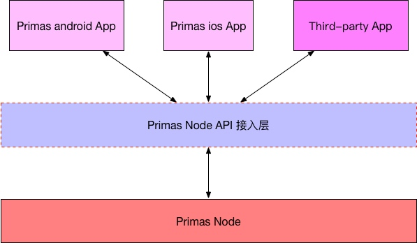

## Primas Node API Document DApp介绍
##### Primas DApp是一个开放的内容发布、推荐和社交平台，是基于DTCP协议的首个去中心化应用场景。DApp所有上传的数据全部需要签名验证并上链，所有数据真实不可篡改。为了Primas之外的其他内容平台都可以方便的接入到Primas生态中来，提供了Primas Node API接入文档，第三方内容平台的开发者阅读本接口文档来帮助开发。开发者按照文档规范实现功能接口，就可以实现与Primas Node提供的各种业务的轻松对接。 

  

